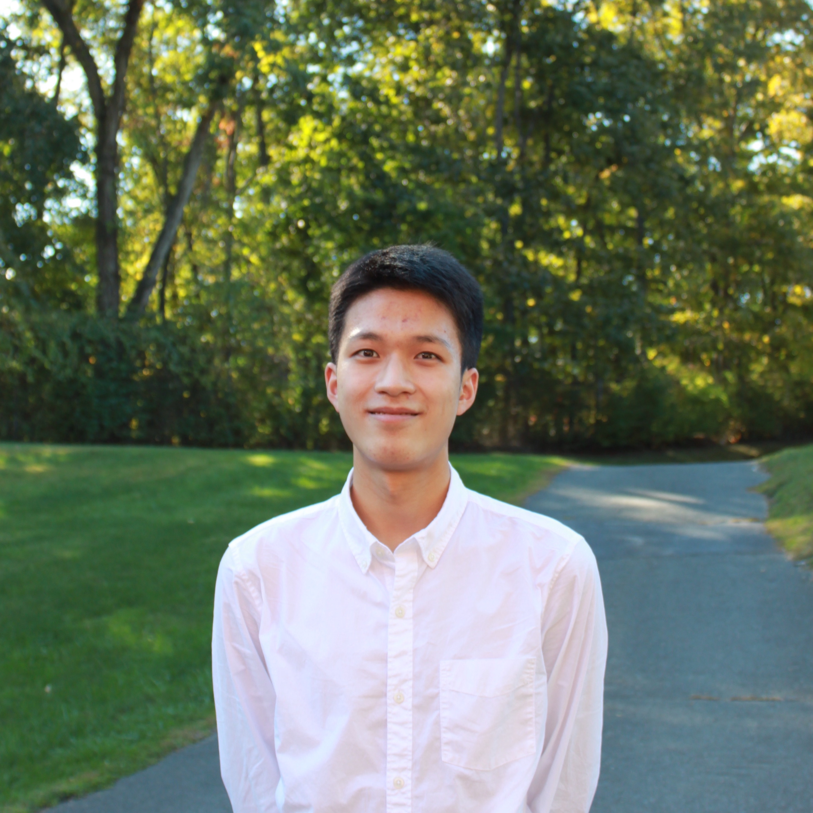

{: style="float: left"; margin-right: 5em}

Elvin is an incoming freshman at Harvard University concentrating in Computer Science and Mathematics. He has been named a Regeneron Science Talent Search Top 300 Scholar for his research on AI-driven drug discovery, qualified three times for the American Invitational Mathematics Examination, made the US National Chemistry Olympiad Honors List of the top 150 scorers, and competed in the USA Computing Olympiad Gold Division. He volunteers to teach English to Spanish-speaking immigrants at Neighbors Link in Mount Kisco and was given the Horace Greeley School Service Award. He is also an avid enthusiast of modular geometric origami.

Daphne is an incoming freshman at Brown University concentrating in English. She has participated in numerous writing programs such as the Iowa Young Writers’ Studio and Bard College at Simon’s Rock Young Writers Workshop. She volunteers as an editor for Polyphony Lit and for A New Chance Animal Rescue. She has won numerous honors from the Scholastic Art and Writing Awards. She specializes in college consulting for humanities majors and essay editing. During her free time, Daphne loves biking on nearby trails.

Ethan is an incoming freshman at Columbia University majoring in Astrophysics and East Asian Languages and Cultures. In high school, Ethan determined the orbit of a near-Earth asteroid at the Caltech-MIT Summer Science Program (SSP) and volunteered at an alpine garden. He recently graduated with a precollege diploma in classical cello from the Manhattan School of Music. Ethan specializes in consulting for the sciences and social sciences, and he’s also happy to help with the college search and essay revision. He enjoys listening to Polish music and making fresh juice. His latest juice was mango with Vietnamese cinnamon, rhubarb, lemon, honey, and taro root.
