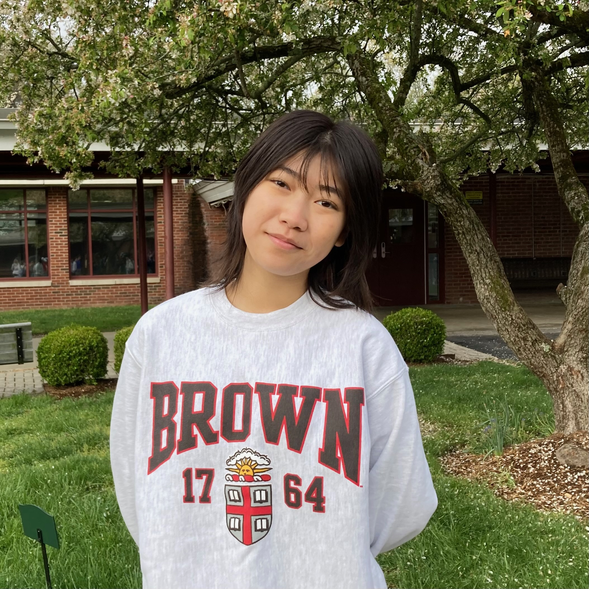
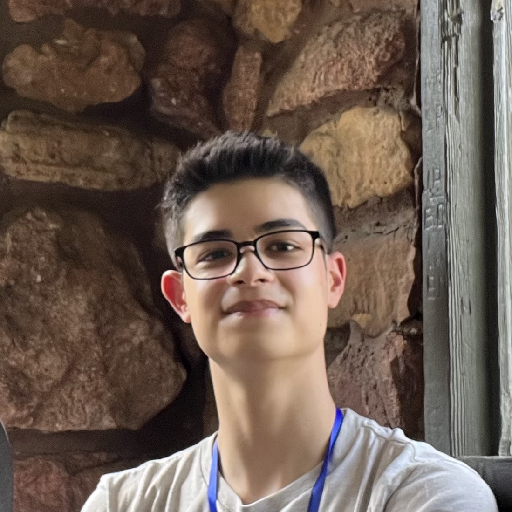

| | |
|---|---|
|  | **[Elvin](https://www.linkedin.com/in/elvin-lo/)** is an incoming freshman at Harvard University concentrating in Computer Science and Mathematics. He has been named a Regeneron Science Talent Search Top 300 Scholar for his research on AI-driven drug discovery, qualified three times for the American Invitational Mathematics Examination, made the US National Chemistry Olympiad Honors List of the top 150 chemistry students, and competed in the USA Computing Olympiad Gold Division. He has been a volunteer tutor in groups like Neighbors Link in Mount Kisco and the Horace Greeley Peer Tutoring Club. He is also an avid enthusiast of modular geometric origami.    Elvin specializes in college consulting for prospective STEM majors and is well versed in competitions like Olympiads, STEM camps and programs, and other STEM opportunities you may be interested in. |
|  | **Daphne** is an incoming freshman at Brown University concentrating in English. She has participated in numerous writing programs such as the Iowa Young Writers’ Studio and Bard College at Simon’s Rock Young Writers Workshop. She volunteers as an editor for Polyphony Lit and for A New Chance Animal Rescue. She has won numerous honors from the Scholastic Art and Writing Awards. During her free time, Daphne loves biking on nearby trails.    Daphne specializes in college consulting for humanities majors and essay editing. |
|  | **[Ethan](https://www.linkedin.com/in/ethan-kuperman-a5a501250)** is an incoming freshman at Columbia University majoring in Astrophysics and East Asian Languages and Cultures. In high school, Ethan determined the orbit of a near-Earth asteroid at the Caltech-MIT Summer Science Program (SSP), conducted research on Polish religious history and premodern Chinese social history, and volunteered at an alpine garden. He recently graduated with a precollege diploma in classical cello from the Manhattan School of Music. In his free time, he enjoys listening to Polish music and making juice.    Ethan specializes in consulting for the sciences and social sciences, and he’s happy to help with all parts of the application process. |
| | |
